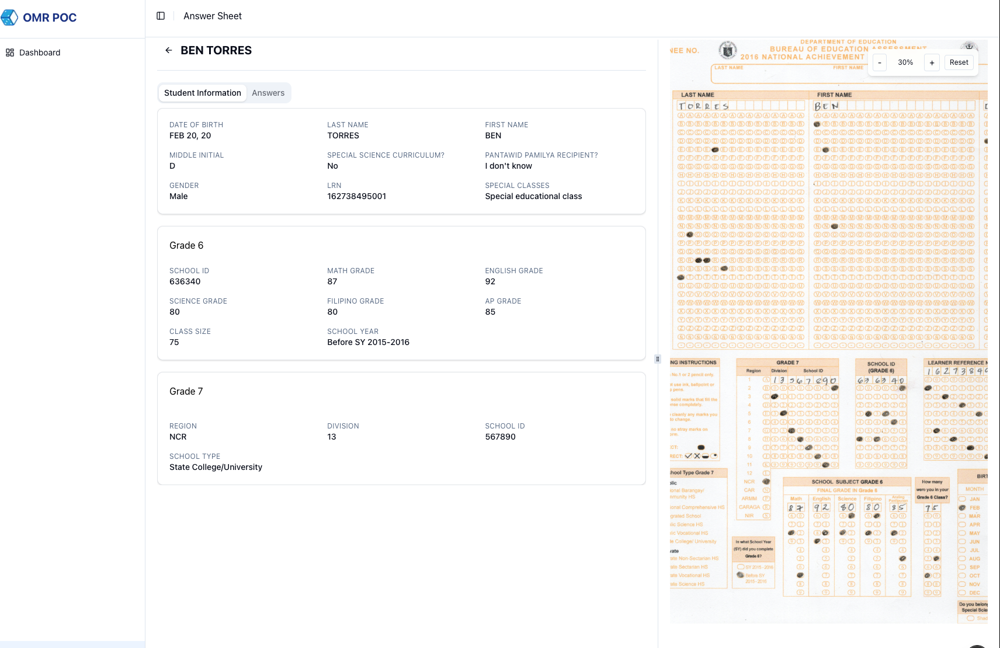
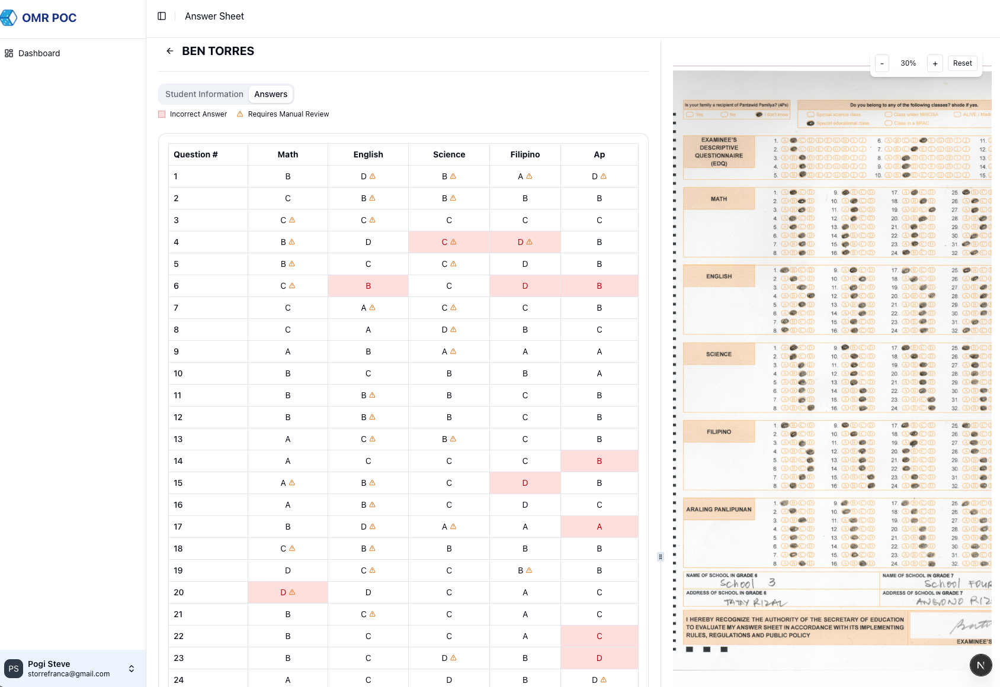

# OMR Processing System

An end-to-end Optical Mark Recognition (OMR) system that processes scanned answer sheets, extracts structured student data, scores subject responses, and provides a web-based review interface.

The system consists of:
- Python-based OMR engine (image processing + scoring)
- NestJS backend API (authentication + persistence)
- Next.js frontend (review dashboard)
- Shared SQLite database

---

# ⚙️ Technology Stack

## Backend API
- NestJS
- Drizzle ORM
- SQLite (better-sqlite3)
- JWT Authentication
- bcrypt password hashing

## OMR Engine
- Python
- OpenCV
- Deskew and normalization
- Bubble grid calibration
- Fill ratio and contour-based scoring
- Debug heatmaps

## Frontend
- Next.js 16 (App Router)
- React 19
- NextAuth (Credentials Provider)
- BFF pattern via `/api/*` routes
- Proxy-based route protection

---

# 🔐 Authentication

Role-based authentication with JWT.

Authentication Flow:

1. NextAuth (Credentials) handles login in the frontend.
2. Credentials are sent to NestJS `/auth/login`.
3. NestJS returns a signed JWT (`accessToken`).
4. JWT is stored in NextAuth session (JWT strategy).
5. Frontend calls protected resources via BFF (`/api/*`).
6. BFF forwards requests to NestJS with `Authorization: Bearer <jwt>`.
7. NestJS validates via `JwtAuthGuard`.

Supported roles:
- `admin`
- `user`

Seeded demo accounts:

| Email | Password | Role |
|-------|----------|------|
| storrefranca@gmail.com | password | admin |
| aldrich.abrogena@dice205.com | password | admin |

Passwords are hashed using bcrypt.

---

# 🗄 Database

- SQLite (`omr.db`)
- Shared between Python OMR processor and NestJS backend
- WAL mode enabled for multi-process safety
- Foreign keys enabled

Core tables:
- `omr_scan`
- `student`
- `current_school`
- `previous_school`
- `student_answer`
- `seed_history`

Schema is normalized for analytics and reporting.

---

# 🖼 Screenshots

## 🔐 Login Page


## 📊 Dashboard


## 👤 Student Information


## 📋 Answer Matrix Review


---

# 🚀 Setup Guide

## 1. Install SQLite

macOS:

```bash
brew install sqlite
sqlite3 --version
```

---

## 2. Create Database

From project root:

```bash
touch omr.db
```

Ensure backend `.env` contains:

```bash
OMR_DB_PATH=../omr.db
```

---

## 3. Install Backend

```bash
cd be-omr-demo
npm install
```

---

## 4. Install Frontend

```bash
cd fe-omr-demo
npm install
```

---

## 5. Apply Schema

From `be-omr-demo`:

```bash
npx drizzle-kit push
```

---

## 6. Seed Users

```bash
npx ts-node seeds/seed-users.ts
```

---

## 7. Start Backend

```bash
npm run start:dev
```

Default: http://localhost:4000

---

## 8. Configure Frontend Environment

Create `.env.local` inside `fe-omr-demo`:

```bash
NEXTAUTH_URL=http://localhost:3000
NEXTAUTH_SECRET=your_random_secret_here
NEXT_API_URL=http://localhost:4000
```

Notes:
- `NEXTAUTH_SECRET` is used by NextAuth.
- `JWT_SECRET` must be configured separately in the backend.

---

## 9. Start Frontend

```bash
cd fe-omr-demo
npm run dev
```

Default: http://localhost:3000

---

# ✅ System Capabilities

- Image-based bubble detection
- Confidence-driven scoring
- Question-level review flags
- Matrix-based answer comparison
- Role-based access control
- Shared SQLite persistence

---

# 🔮 Future Enhancements

- Handwritten field recognition
- Confidence threshold tuning
- Bulk scan ingestion pipeline
- Analytics dashboard
- Export to CSV / PDF

---

This project demonstrates a production-ready OMR architecture combining computer vision, structured persistence, and a modern full-stack review interface.

---