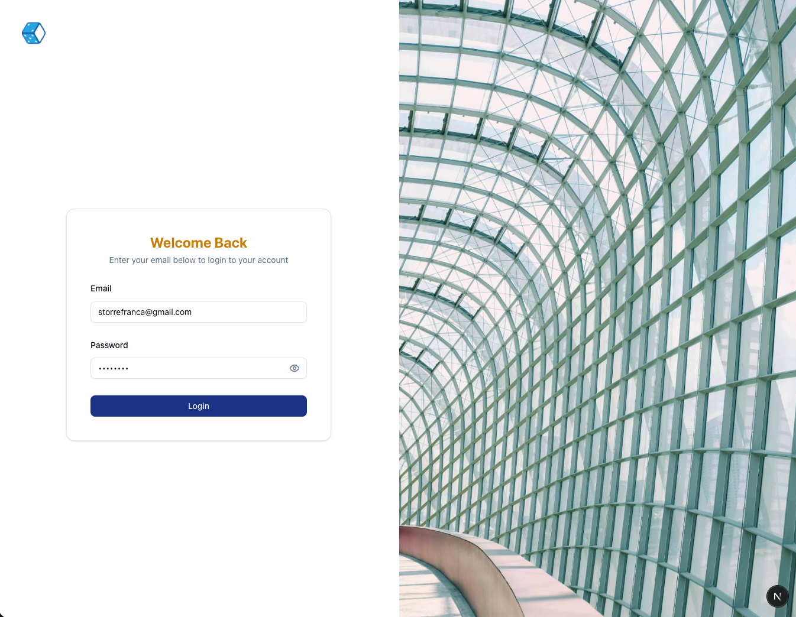
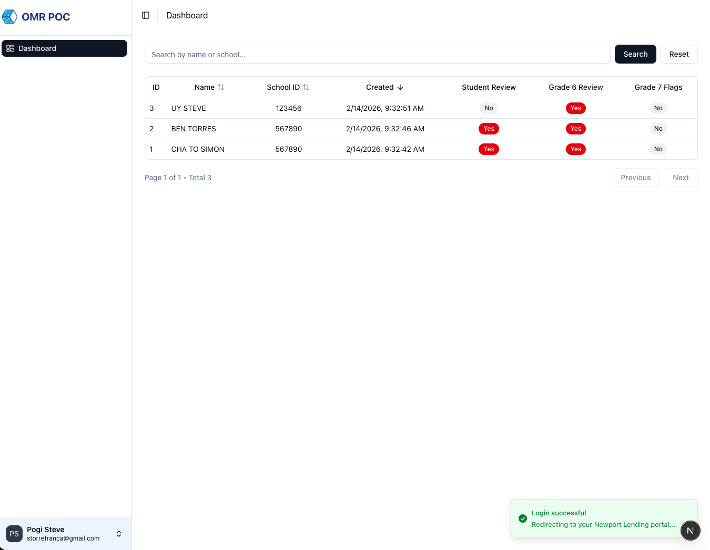

---

# ⚙️ Technology Stack

## Backend API
- NestJS
- Drizzle ORM
- SQLite (better-sqlite3)
- JWT Authentication
- bcrypt password hashing

## OMR Engine
- Python
- OpenCV
- Deskew and normalization
- Bubble grid overlay validation
- Fill ratio and contour-based scoring
- Debug heatmaps

## Frontend
- Next.js 16 (App Router)
- React 19
- NextAuth (Credentials Provider)
- BFF pattern via `/api/*` routes
- Proxy-based route protection

---

# 🔐 Authentication

Role-based authentication with JWT.

Authentication Flow:

1. NextAuth (Credentials) handles login in the frontend.
2. Credentials are sent to NestJS `/auth/login`.
3. NestJS returns a signed JWT (`accessToken`).
4. JWT is stored in NextAuth session (JWT strategy).
5. Frontend calls protected resources via BFF (`/api/*`).
6. BFF forwards requests to NestJS with `Authorization: Bearer <jwt>`.
7. NestJS validates via `JwtAuthGuard`.

Supported roles:
- `admin`
- `user`

Seeded demo accounts:

| Email | Password | Role |
|-------|----------|------|
| storrefranca@gmail.com | password | admin |
| aldrich.abrogena@dice205.com | password | admin |

Passwords are hashed using bcrypt.

---

# 🖼 Screenshots

## 🔐 Login Page



## 📊 Dashboard




---

# 🗄 Database

- SQLite (`omr.db`)
- Shared between Python OMR processor and NestJS backend
- WAL mode enabled for multi-process safety
- Foreign keys enabled

Seed tracking is handled via a `seed_history` table to prevent duplicate seed execution.

---

# 🚀 Setup Instructions

## 1️⃣ Install SQLite

Make sure SQLite is installed on your machine.

### macOS (Homebrew)

```bash
brew install sqlite
```

Verify installation:

```bash
sqlite3 --version
```

---

## 2️⃣ Create OMR Database

From the project root:

```bash
touch omr.db
```

This creates the shared SQLite database used by both:
- Python OMR engine
- NestJS backend

Ensure your `.env` contains:

```bash
OMR_DB_PATH=../omr.db
```

---

## 3️⃣ Install Backend Dependencies

```bash
cd be-omr-demo
npm install
```

---

## 3️⃣ Install Frontend Dependencies

cd fe-omr-demo
npm install

---

## 4️⃣ Run Drizzle Schema Push / Migration

From `be-omr-demo`:

```bash
npx drizzle-kit push
```

This will:
- Create `users` table
- Create `seed_history` table
- Apply schema to `omr.db`

---

## 5️⃣ Run Seeds

```bash
npx ts-node seeds/seed-users.ts
```

This will insert:
- Admin user
- Regular user

Seed execution is tracked in `seed_history` to prevent duplicates.

---

## 6️⃣ Start Backend (Development Mode)

```bash
npm run start:dev
```

---

## 7️⃣ Configure Environment Variables (Frontend)

Create `.env.local` inside the frontend project:

NEXTAUTH_URL=http://localhost:3000
NEXTAUTH_SECRET=your_random_secret_here
NEXT_API_URL=http://localhost:4000

Note:
- `NEXTAUTH_SECRET` is used by NextAuth.
- `JWT_SECRET` (backend) must be configured separately in NestJS.
- `NEXT_API_URL` is used by BFF routes to call the backend.

---

## 8️⃣ Start Frontend

cd fe-omr-demo
npm run dev

---

The system is now ready for:
- Authentication (NextAuth + NestJS JWT)
- Protected API access via BFF
- OMR processing (Python + OpenCV)
- Shared SQLite persistence layer
